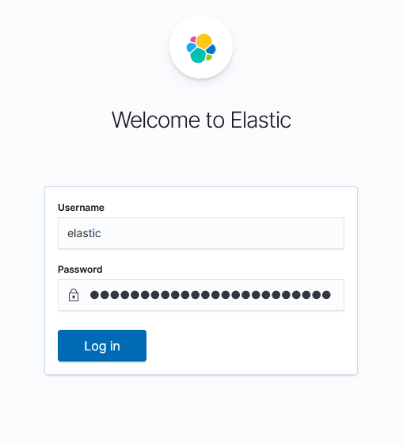
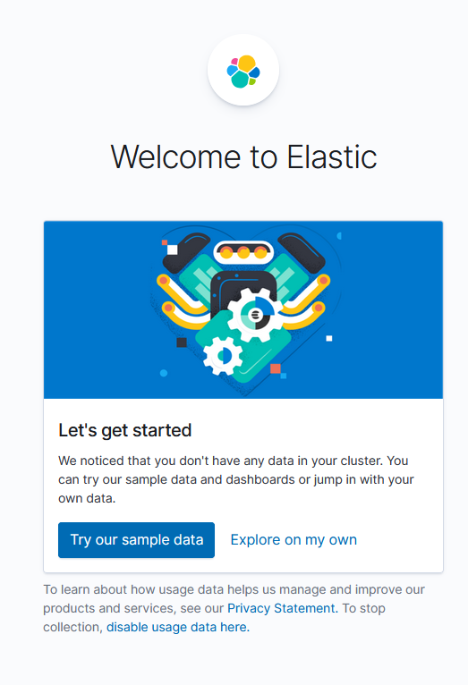
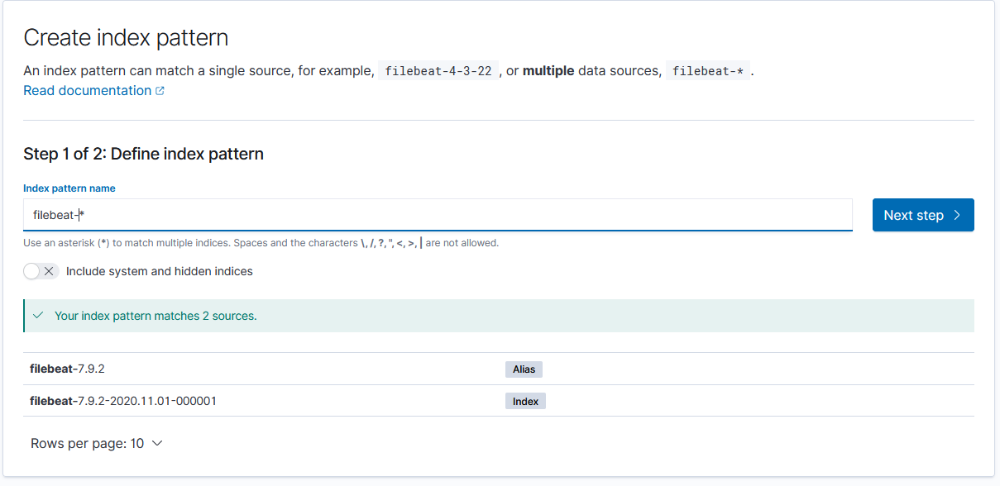
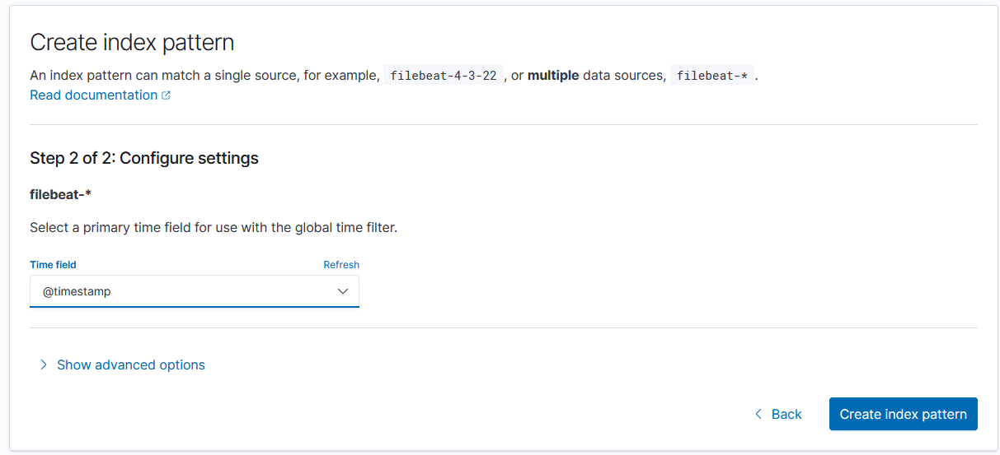
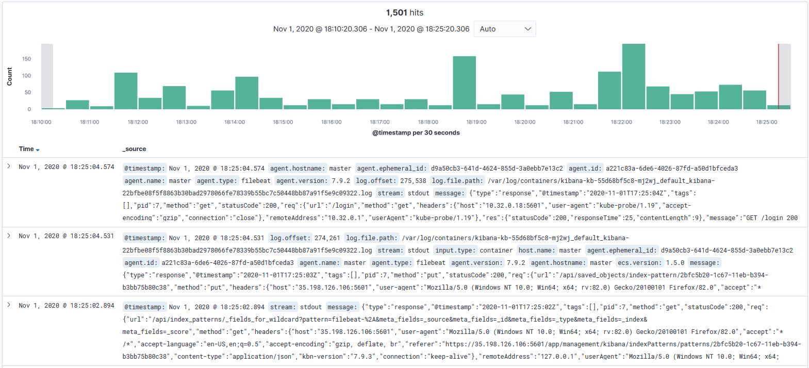

# Logging

Machine : **master**

## Simple

Avec la CLI kubectl, nous pouvons d'ores et déjà récupérer plusieurs logs concernant notre cluster Kubernetes.

1. Tout d'abord, nous pouvons récupérer des informations sur le cluster, ainsi que de certains composants de ce cluster de la façon suivante :

```bash
training@master$ kubectl cluster-info

Kubernetes master is running at https://10.156.0.3:6443
KubeDNS is running at https://10.156.0.3:6443/api/v1/namespaces/kube-system/services/kube-dns:dns/proxy
Metrics-server is running at https://10.156.0.3:6443/api/v1/namespaces/kube-system/services/https:metrics-server:/proxy

To further debug and diagnose cluster problems, use 'kubectl cluster-info dump'.
```

2. Nous pouvons egalement voir tout les évenements qui ont eu lieu dans le cluster. Un évenement peut désigner le rescheduling d'un pod, la mise à jour d'un deployment, la création d'un PV ou binding d'un PVC à un PV. Nous pouvons avoir toute ces infos de la façon suivante :

```bash
training@master$ kubectl get events -A

LAST SEEN   TYPE      REASON                 OBJECT                                       MESSAGE
81s         Normal    ExternalProvisioning   persistentvolumeclaim/postgres-openebs-pvc   waiting for a volume to be created, either by external provisioner "openebs.io/provisioner-iscsi" or manually created by system administrator
89s         Normal    Provisioning           persistentvolumeclaim/postgres-openebs-pvc   External provisioner is provisioning volume for claim "default/postgres-openebs-pvc"
```

3. Nous allons maintenant voir comment récupérer les logs générés par les conteneurs d'un pod. Commençons par créer un pod avec l'image nginx à titre d'exemple :

```bash
training@master$ kubectl run --image nginx test-logs

pod/test-logs created
```

4. Nous pouvons récupérer les logs de ce pod de la facon suivante :

```bash
training@master$ kubectl logs test-logs

/docker-entrypoint.sh: /docker-entrypoint.d/ is not empty, will attempt to perform configuration
/docker-entrypoint.sh: Looking for shell scripts in /docker-entrypoint.d/
/docker-entrypoint.sh: Launching /docker-entrypoint.d/10-listen-on-ipv6-by-default.sh
10-listen-on-ipv6-by-default.sh: Getting the checksum of /etc/nginx/conf.d/default.conf
10-listen-on-ipv6-by-default.sh: Enabled listen on IPv6 in /etc/nginx/conf.d/default.conf
/docker-entrypoint.sh: Launching /docker-entrypoint.d/20-envsubst-on-templates.sh
/docker-entrypoint.sh: Configuration complete; ready for start up
```

5. Notez également que les pods system stockent également des logs dans les dossiers /var/log/containers et /var/log/pods, on peut donc les voir de la façon suivante :

```bash
training@master$ sudo cat /var/log/containers/*

...
{"log":"I1027 12:51:51.629401       1 client.go:360] parsed scheme: \"passthrough\"\n","stream":"stderr","time":"2020-10-27T12:51:51.629623287Z"}
{"log":"I1027 12:51:51.629456       1 passthrough.go:48] ccResolverWrapper: sending update to cc: {[{https://127.0.0.1:2379  \u003cnil\u003e 0 \u003cnil\u003e}] \u003cnil\u003e \u003cnil\u003e}\n","stream":"stderr","time":"2020-10-27T12:51:51.629671282Z"}
{"log":"I1027 12:51:51.629471       1 clientconn.go:948] ClientConn switching balancer to \"pick_first\"\n","stream":"stderr","time":"2020-10-27T12:51:51.62968064Z"}
```

6. Enfin une dernière façon de regarder les logs des differents conteneurs peuplant notre cluster kubernetes est d'utiliser tout simplement Docker :

```bash
training@master$ docker ps -a
training@master$ docker logs ID_CONTENEUR
```

7. Voila, nous allons maintenant supprimer notre pod de test :

```bash
training@master$ kubectl delete pod test-logs

pod "test-logs" deleted
```

## Stack Elastic

machine : **master**

```bash
training@master$ mkdir eck
training@master$ cd eck
```

1. Commençons par installer les composants essentiels de ECK, notamment elastic-operator :

```bash
training@master$ kubectl apply -f https://download.elastic.co/downloads/eck/1.2.1/all-in-one.yaml
```

2. Nous pouvons monitorer le déploiement d'elastic-operator de la façon suivante :

```bash
training@master$ kubectl -n elastic-system logs -f statefulset.apps/elastic-operator

...
{"log.level":"info","@timestamp":"2020-11-01T17:01:06.426Z","log.logger":"controller-runtime.controller","message":"Starting workers","service.version":"1.2.1-b5316231","service.type":"eck","ecs.version":"1.4.0","controller":"enterprisesearch-controller","worker count":3}
{"log.level":"info","@timestamp":"2020-11-01T17:01:06.426Z","log.logger":"controller-runtime.controller","message":"Starting workers","service.version":"1.2.1-b5316231","service.type":"eck","ecs.version":"1.4.0","controller":"elasticsearch-controller","worker count":3}
```

3. Nous allons maintenant déployer un elasticsearch. Avec ECK, de nouvelles CustomeDefinitions sont ajoutées au cluster. L'une parmi elles permet notamment de définir un serveur Elasticsearch via yaml. Nous allons donc créer un fichier elasticsearch.yaml :

```bash
training@master$ touch elasticsearch.yaml
```

Avec le contenu yaml suivant :

```yaml
apiVersion: elasticsearch.k8s.elastic.co/v1
kind: Elasticsearch
metadata:
  name: elasticsearch
spec:
  version: 7.9.3
  nodeSets:
  - name: default
    count: 1
    volumeClaimTemplates:
    - metadata:
        name: elasticsearch-data
      spec:
        accessModes:
        - ReadWriteOnce
        resources:
          requests:
            storage: 5Gi
        storageClassName: openebs-custom-sc
    config:
      node.master: true
      node.data: true
      node.ingest: true
      node.store.allow_mmap: false
```

4. Nous pouvons donc créer notre serveur Elasticsearch :

```bash
training@master$ kubectl apply -f elasticsearch.yaml

elasticsearch.elasticsearch.k8s.elastic.co/elasticsearch created
```

5. Nous pouvons voir le déroulement de son déploiement de la façon suivante :

```bash
training@master$ kubectl get elasticsearch elasticsearch

NAME            HEALTH   NODES   VERSION   PHASE   AGE
elasticsearch   green    1       7.9.3     Ready   106s
```

6. Un service exposant notre elasticsearch est créé lors du deploiement, nous pouvons le voir de la façon suivante :

```bash
training@master$ kubectl get service elasticsearch-es-http

NAME                    TYPE        CLUSTER-IP     EXTERNAL-IP   PORT(S)    AGE
elasticsearch-es-http   ClusterIP   10.99.41.114   <none>        9200/TCP   2m24s
```

7. Testons la connexion a notre elasticsearch :

```bash
training@master$ PASSWORD=$(kubectl get secret elasticsearch-es-elastic-user -o go-template='{{.data.elastic | base64decode}}')
training@master$ curl -u "elastic:$PASSWORD" -k "https://CLUSTER_IP_ELASTICSEARCH:9200"

{
  "name" : "elasticsearch-es-default-0",
  "cluster_name" : "elasticsearch",
  "cluster_uuid" : "76FfZR4ARxO78QBQw_kBhg",
  "version" : {
    "number" : "7.9.3",
    "build_flavor" : "default",
    "build_type" : "docker",
    "build_hash" : "c4138e51121ef06a6404866cddc601906fe5c868",
    "build_date" : "2020-10-16T10:36:16.141335Z",
    "build_snapshot" : false,
    "lucene_version" : "8.6.2",
    "minimum_wire_compatibility_version" : "6.8.0",
    "minimum_index_compatibility_version" : "6.0.0-beta1"
  },
  "tagline" : "You Know, for Search"
}
```

Parfait !

8. Nous allons maintenant passer à l'installation de Kibana. De la même maniere, nous allons définir un fichier kibana.yaml permettant de deployer notre kibana :

```bash
training@master$ touch kibana.yaml
```

Avec le contenu yaml suivant :

```yaml
apiVersion: kibana.k8s.elastic.co/v1
kind: Kibana
metadata:
  name: kibana
spec:
  version: 7.9.3
  count: 1
  elasticsearchRef:
    name: elasticsearch
```

9. Nous pouvons donc créer notre serveur Kibana :

```bash
training@master$ kubectl apply -f kibana.yaml

kibana.kibana.k8s.elastic.co/kibana created
```

10. De la même maniere qu'elasticsearch, nous pouvons voir l'état de notre Kibana de la façon suivante :

```bash
training@master$ kubectl get kibana kibana

NAME     HEALTH   NODES   VERSION   AGE
kibana   green    1       7.9.3     2m23s
```

11. De même, un service pour Kibana est créé, nous pouvons le voir de la façon suivante :

```bash
training@master$ kubectl get service kibana-kb-http

NAME             TYPE        CLUSTER-IP      EXTERNAL-IP   PORT(S)    AGE
kibana-kb-http   ClusterIP   10.106.23.116   <none>        5601/TCP   2m45s
```

12. Nous allons récupérer le mot de passe de Kibana :

```bash
training@master$ kubectl get secret elasticsearch-es-elastic-user -o=jsonpath='{.data.elastic}' | base64 --decode; echo

pb809RTC51EVCd3f19i9UVW5
```

13. Nous allons faire un port-forward de notre service pour pouvoir se connecter dessus via un navigateur :

```bash
training@master$ kubectl port-forward --address 0.0.0.0 service/kibana-kb-http 5601
```

Notre Kibana est donc installé ! Vous pouvez y'acceder à l'aide de l'URL suivante : https://MASTER_EXTERNAL_IP:5601

Page d'authentification :



Page d'accueil :



14. Nous allons maintenant collecter des logs . Nous allons installé un filebeat et récupérer les logs se trouvant dans /var/log/containers, /var/lib/docker/containers et /var/log/pods/. On va donc créer le fichier filebeat.yaml suivant :

```bash
training@master$ touch filebeat.yaml
```

Avec le contenu yaml suivant :

```yaml
apiVersion: beat.k8s.elastic.co/v1beta1
kind: Beat
metadata:
  name: filebeat
spec:
  type: filebeat
  version: 7.9.2
  elasticsearchRef:
    name: elasticsearch
  config:
    filebeat.inputs:
    - type: container
      paths:
      - /var/log/containers/*.log
  daemonSet:
    podTemplate:
      spec:
        dnsPolicy: ClusterFirstWithHostNet
        hostNetwork: true
        securityContext:
          runAsUser: 0
        containers:
        - name: filebeat
          volumeMounts:
          - name: varlogcontainers
            mountPath: /var/log/containers
          - name: varlogpods
            mountPath: /var/log/pods
          - name: varlibdockercontainers
            mountPath: /var/lib/docker/containers
        volumes:
        - name: varlogcontainers
          hostPath:
            path: /var/log/containers
        - name: varlogpods
          hostPath:
            path: /var/log/pods
        - name: varlibdockercontainers
          hostPath:
            path: /var/lib/docker/containers
```

15. Nous pouvons donc créer notre filebeat :

```bash
training@master$ kubectl apply -f filebeat.yaml

beat.beat.k8s.elastic.co/filebeat created
```

16. Nous pouvons voir l'état de notre filebeat de la façon suivante :

```bash
training@master$ kubectl get beat

NAME       HEALTH   AVAILABLE   EXPECTED   TYPE       VERSION   AGE
filebeat   green    2           2          filebeat   7.9.2     94s
```

17. Nous pouvons créer un index pattern en allant sur Discover -> Create index pattern -> Mettre "filebeat-*" en index pattern name -> Mettre @timestamp en time field :

Creation de l'index pattern :


Nom de l'index pattern :



Time Field :



18. Nous pouvons voir les logs ou bien sur *Discover* ou bien sur *Logs* :

Discover :



Logs :


## Clean Up

Pour désinstaller notre stack ELK via ECK :

```bash
training@master$ kubectl delete -f .

elasticsearch.elasticsearch.k8s.elastic.co "elasticsearch" deleted
beat.beat.k8s.elastic.co "filebeat" deleted
kibana.kibana.k8s.elastic.co "kibana" deleted
```
